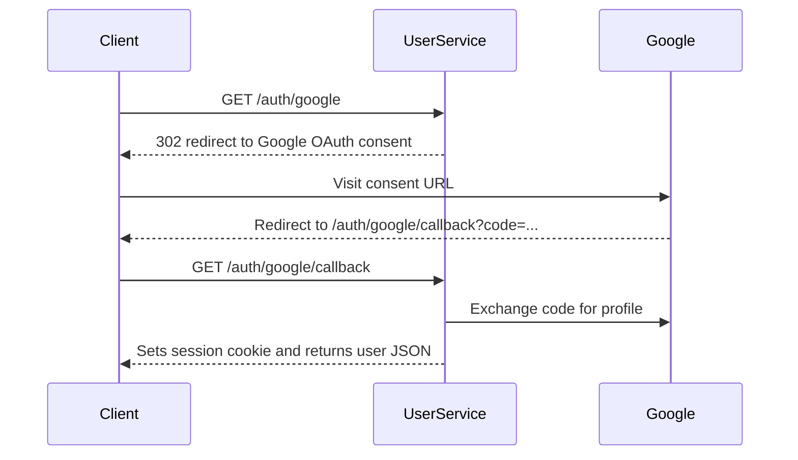

# Auth Diagrams

## Google Auth Flow

```mermaid
sequenceDiagram
  participant Client
  participant UserService
  participant Google

  Client->>UserService: GET /auth/google
  UserService-->>Client: 302 redirect to Google OAuth consent
  Client->>Google: Visit consent URL
  Google-->>Client: Redirect to /auth/google/callback?code=...
  Client->>UserService: GET /auth/google/callback
  UserService->>Google: Exchange code for profile
  UserService-->>Client: Sets session cookie and returns user JSON
```
